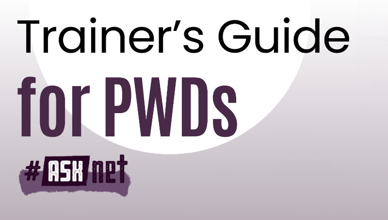
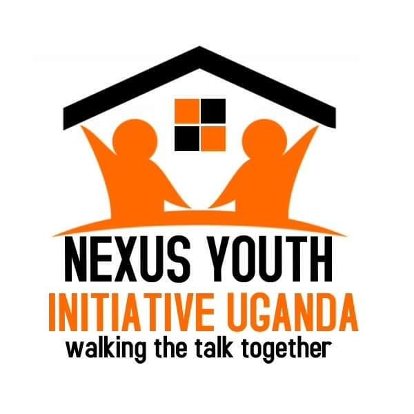

# Trainer’s Guide for PWDs

This guide, which was developed with refugees, provides preparatory support for training and curriculum development. Its aim is to address inclusion in training programmes in refugee camps.
It covers three types of disability: general physical disabilities (such as paralysis), and specific disabilities (such as blindness and deafness). It offers advice on adapting the training environment to these circumstances.

It also distinguishes between general support services and those specifically designed for media use.

 

  

 

## Learning Objective 
This Guide 
+ informs people about the different types of disabilities.
+ explains how to adapt the training environment to include people with disabilities.
+ lists media training support tools.

## Table of Content

+ Trainer’s Guide for PWDs
    + [Download Version](/materials/Trainers_Guide_PWDs-reduced_file.pdf)
    + [Print Version](/materials/Trainers_Guide_PWDs-Print.pdf)
+ Documentary [Voice of Resilience](https://www.youtube.com/watch?v=zccmWhQdZAo)

### Partners and the Network
 

 
  

